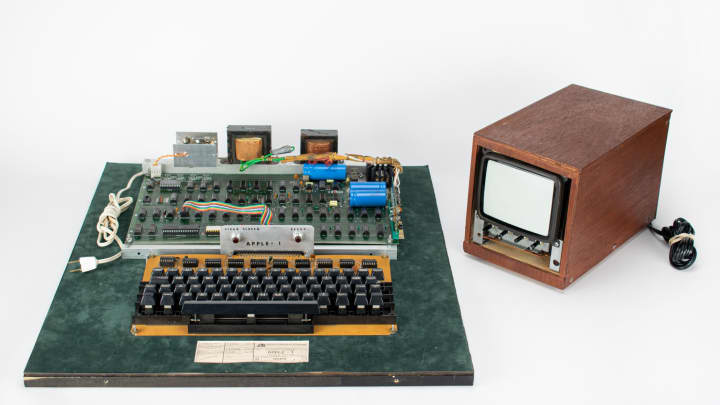

# HW-2

Here is a link to my completed project: [HW-2]()a
The goal of this project was to create a functioning portfolio page that:

Presents the developer's name, a recent photo, and links to sections about them, their work, and how to contact them
`<!-- Nav bar -->
    <nav class="navbar">
        <button id="about-btn">About</button>
        <button id="contact-btn">Contact</button>
        <button id="port-btn">Portfolio</button>
        <button id="res-btn">Resume</button>
    </nav>`

WHEN I click one of the links in the navigation
THEN the UI scrolls to the corresponding section

`// When you click the about button
aboutBtn.addEventListener("click", displayAbout);
// Display the about section
function displayAbout(){
// Hide the other sections
    contactCard.classList.add('hide');

    portCard.classList.add('hide');

    resCard.classList.add('hide');

    console.log("clicked");
    
    aboutCard.classList.remove('hide');

};`

WHEN I click on the link to the section about their work
THEN the UI scrolls to a section with titled images of the developer's applications

`// When you click the contact button
contactBtn.addEventListener("click", displayContact);
// Display the contact section
function displayContact(){
// Hide the other section
    aboutCard.classList.add('hide');

    portCard.classList.add('hide');

    resCard.classList.add('hide');

    console.log("clicked");
    
    contactCard.classList.remove('hide');

};`

WHEN I am presented with the developer's first application
THEN that application's image should be larger in size than the others

`

            <h1>Portfolio</h1>
            
            
            

`

WHEN I click on the images of the applications
THEN I am taken to that deployed application

``

WHEN I resize the page or view the site on various screens and devices
THEN I am presented with a responsive layout that adapts to my viewport

`@media screen and (max-width: 800px) {
    .navbar{
        width: 100%;
        height: 80%;
        display: flex;
        align-items: center;
        padding-top: 25%;
        margin-left: 45%;
    }

    .showcase {
        width: 35%;
        margin-left: 2%;
        margin-top: -100px;
    }

    .banner{
        position: fixed;
        top: -25px;
        left: -80px;
    }

    .app-text h1 span{
        color: #54f56f;
    }

    .social-icons{
        position: fixed;
        right: 1.1%;
        top: 35.5%; 
    }
  }`